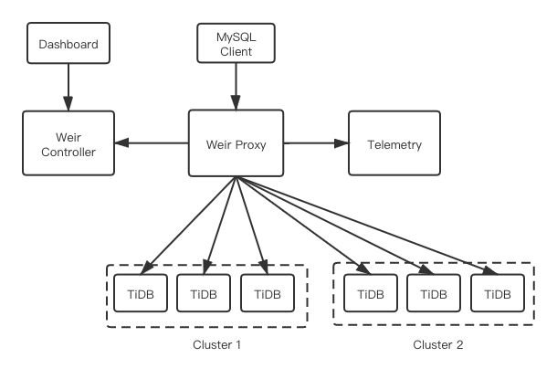

# Weir

Weir is a database proxy middleware platform, mainly providing traffic management for TiDB.

Weir is maintained by [伴鱼](https://www.ipalfish.com/) and [PingCAP](https://pingcap.com/).

[中文文档](README-CN.md)

## Features

- __L7 Proxy__

Weir provides application layer proxy for MySQL Protocol, and it is compatible with TiDB 4.0.

- __Connection Management__

Weir uses connection pool for backend connection management, and supports load balancing.

- __Multi-tenant Management__

Weir supports multi-tenant management. All the namespaces can be dynamic reloaded in runtime.

- __Fault Tolerance__

Weir supports rate limiting and circuit breaking to protect both clients and TiDB servers.

## Architecture

There are three core components in Weir platform: proxy, controller and UI dashboard.

## Roadmap

- Web Application Firewall (WAF) for SQL
- Database Mesh for TiDB
- SQL audit

## Code of Conduct

This project is for everyone. We ask that our users and contributors take a few minutes to review our [Code of Conduct](code-of-conduct.md).

## License

Weir is under the Apache 2.0 license. See the [LICENSE](./LICENSE) file for details.
