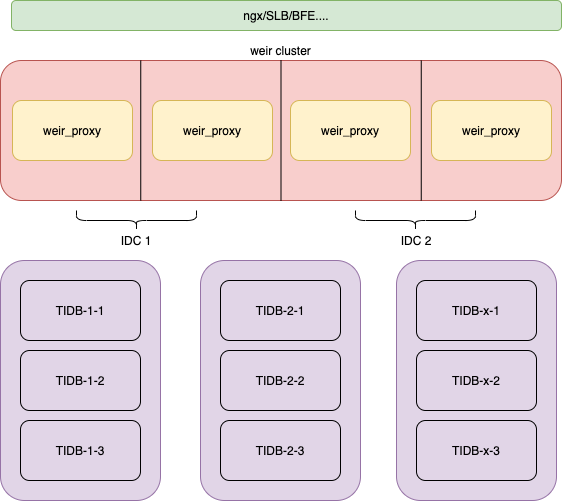
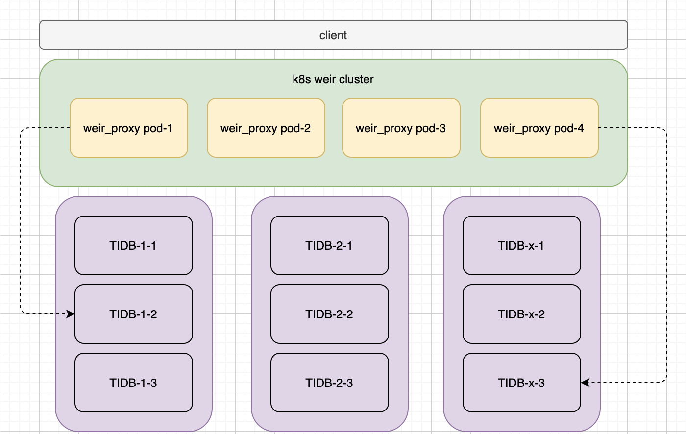

# 部署

## 物理机部署

物理机部署应该尽可能选择多个机房部署, 做到高可用, 其中每个实例应该保持配置相同, 上游可以选择带有健康检查的 Server Load Balancer .

## kubernetes 下部署

kubernetes 下部署可以利用 nodeSelector 将 Pod 尽量调度到不同的 node 节点上, 此操作需要向 Node 对象添加标签就可以将 pod 定位到特定的节点或节点组, 这可以用来确保指定的 Pod 只能运行在具有一定隔离性，安全性或监管属性的节点上. 
其中上游可以直接通过 Service 或者其他转发组件进行转发
