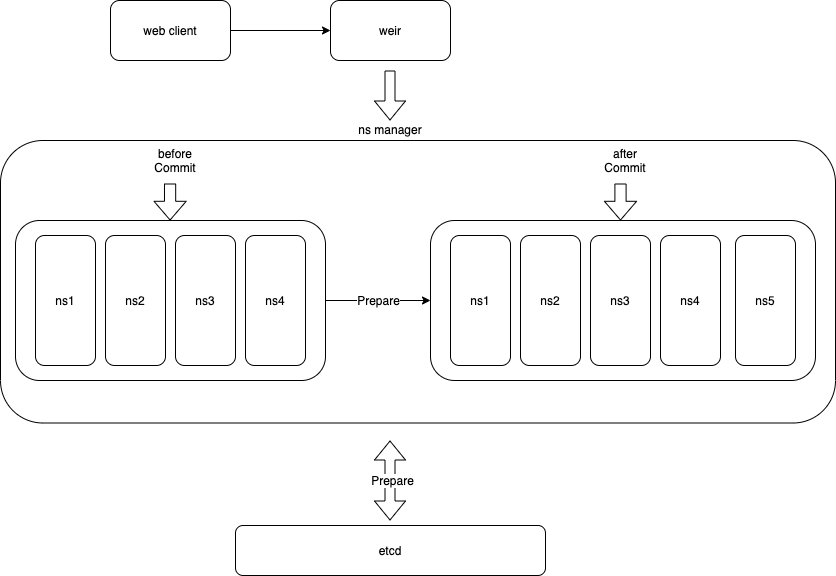

# 配置热加载

Weir 作为多租户的 TiDB 数据库治理平台, 租户配置变更是一项比较频繁的操作. 如果每次增加, 修改, 删除租户配置都需要重新启动 Weir Proxy 才能使配置生效, 无疑会对用户体验和服务稳定性带来很大影响. 因此, 我们为 Weir 的 Namespace 配置提供了热加载支持. (注: 热加载要求配置中心使用 etcd )

Weir 支持通过[管理接口](docs/cn/RESTful_api.md)触发配置热加载, 需要手动触发过程, 其中包括准备 (Prepare) 和提交 (Commit) 两个阶段. Weir 维护了一个双指针队列, 两个指针分别指向当前和准备阶段的 Namespace 队列.
- 在准备阶段, Weir Proxy 会从配置中心拉取 Namespace 的最新配置, 解析配置并初始化 Namespace 存储在准备阶段队列中. 
- 在提交阶段, Weir Proxy会执行一次原子切换操作, 当前队列和准备阶段队列指针调换, 使用新的 Namespace 处理客户端的请求, 同时将旧的 Namespace 延迟关闭.

整个热加载过程, Weir Proxy不会主动关闭客户端连接, 客户端是无感知的, 对于一些非核心配置的调整, 甚至不需要重建后端数据库连接池, 对提升客户端体验和保持Weir本身以及后端TiDB集群稳定性都有比较大的帮助.
