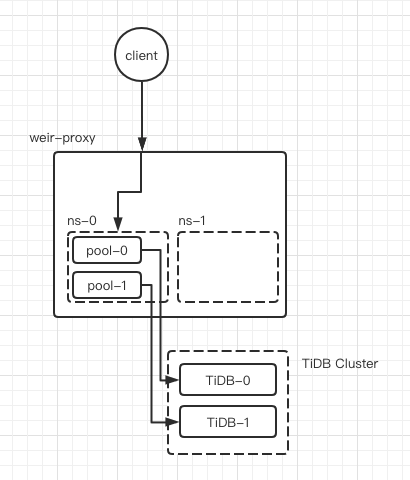

# 连接管理

作为 TiDB 的应用层代理中间件, Weir Proxy 的一项重要职责就是管理客户端的连接与后端 TiDB Server 集群的连接. Weir Proxy 使用连接池机制, 客户端连接可以复用数据库连接执行SQL请求.

## 后端连接池

Weir Proxy 会为每个租户(namespace)的 TiDB Server 集群中的每个实例创建一个连接池, 连接池的配置参数是租户级别的, 其最大连接数是确定的. 客户端在向 Weir Proxy 发起 SQL 查询请求时, Weir Proxy 会首先根据集群负载均衡策略选出一个后端实例, 从该后端实例的连接池中取出一个连接, 根据客户端连接当前状态初始化连接后, 执行 SQL 查询语句, 查询完成后再放回连接池中.

### 连接绑定

对于大多数普通SQL查询, 都可以使用连接池完成. 但是对于一些依赖后端连接状态的查询场景, 连接池就不适用了. 例如: 事务, Prepare查询.

面对这些场景, Weir Proxy的做法是: 在状态改变时从后端连接池取出一个连接, 并"绑定"到当前客户端连接上, 期间客户端连接的所有查询请求全部使用这个绑定连接, 直到状态恢复时, 再将连接放回连接池.

以下命令可能会触发后端连接绑定 (是否真正绑定与当前状态有关):

- BEGIN
- SET AUTOCOMMIT = 0
- Binary Prepare (COM_STMT_PREPARE命令)

以下命令可能会触发后端连接解绑 (是否真正解绑与当前状态有关):

- COMMIT / ROLLBACK
- SET AUTOCOMMIT = 1
- Binary Close (COM_STMT_CLOSE命令)

## 连接状态传递

客户端连接在执行某些SQL语句时会改变自身状态, 这些状态会影响SQL语句的执行, 例如: 切换Database, 设置系统变量等.

当客户端连接执行这些语句时, Weir Proxy会记录这些连接状态, 而在执行真正的查询请求时, Weir Proxy会对后端连接 (连接池连接或绑定连接) 执行一次初始化操作, 将后端连接的状态与客户端连接状态同步, 然后再执行查询请求.

目前支持传递给后端连接的状态:

- USE DB
- 设置Session级别系统变量 (TODO)
