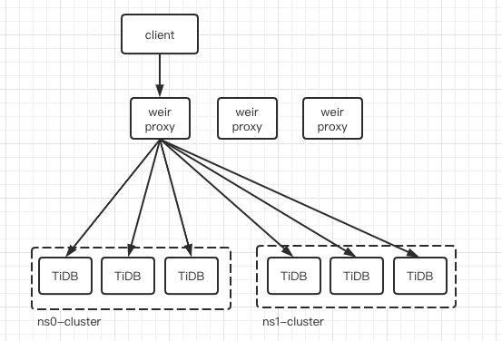

# 多租户软隔离

Weir作为TiDB分布式数据库的统一接入层和治理平台, 需要具备一定的多租户管理能力, 我们将Weir设计成一个共享多租户系统.

## 基本概念

在Weir系统中使用Namespace表示租户. 每个Weir集群可以管理多个Namespace, 每个Namespace有其独立管理的用户 (User) 和资源配置参数. Namespace中的资源主要是指TiDB集群的访问能力.

在Weir集群中, User名称是全局唯一的. 每个User只属于一个Namespace, 每个Namespace可以有多个User. 这样便于在客户端连接Weir Proxy时, 根据MySQL的Username找到其Namespace, 从而确定该User的一些访问权限, 如可访问Database, 访问IP等.

## 软隔离

多个Namespace关联的TiDB集群可以是相同也可以不同, 但Weir Proxy会为每个Namespace创建该TiDB集群的后端连接池, 在后端数据库连接层面将各个Namespace软隔离, 在一定程度上使各个Namespace对同一集群的访问互相不受影响.

各个Namespace可以独立动态加载, 可以动态调整Namespace配置的各项参数, Namespace重新加载时会初始化资源, 并将原有Namespace的资源回收.
